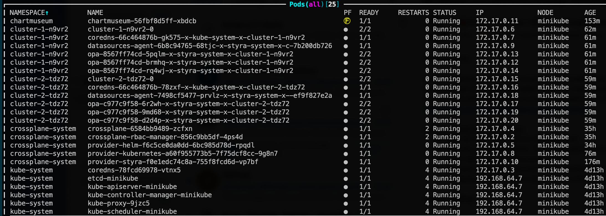
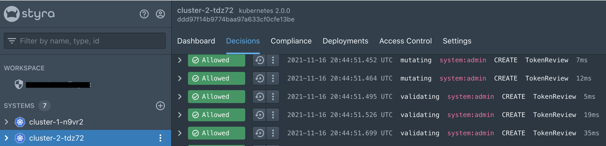

# Virtual Kubernetes clusters with OPA and Styra DAS
This repo provides a [crossplane](https://crossplane.io/) composition to spin up virtual Kubernetes clusters in a host Kubernetes cluster (e.g. `minikube` or `kind` or any cluster really). Those virtual Kubernetes clusters are provisioned with [OPAs](https://www.openpolicyagent.org/) and connected to the [Styra DAS](https://www.styra.com/) control plane. 

More details can be found at the blog post: https://medium.com/@jan.willies/a-kubernetes-controller-for-styra-das-9aa8e11c9947



At Styra DAS, there should be two Kubernetes systems which report the status of the respective clusters:



## Initial setup
we need to install some prerequisites first

### Kubernetes
get a local kubernetes environment, for example via `kind` or `minikube`:
```bash
minikube start
# or
kind create cluster
```
### crossplane
install crossplane into the host cluster:
```
kubectl create ns crossplane-system
helm install crossplane --namespace crossplane-system crossplane-stable/crossplane
```

### provider-helm
install [provider-helm](https://github.com/crossplane-contrib/provider-helm) to later install the `vcluster` and `styra-k8s-system` charts via compositions
```bash
kubectl crossplane install provider crossplane/provider-helm:v0.9.0

# in-cluster rbac, so that provider-helm is allowed to install helm charts into the host cluster
SA=$(kubectl -n crossplane-system get sa -o name | grep provider-helm | sed -e 's|serviceaccount\/|crossplane-system:|g')
kubectl create clusterrolebinding provider-helm-admin-binding --clusterrole cluster-admin --serviceaccount="${SA}"

kubectl apply -f provider-helm/providerconfig.yaml
```

### provider-kubernetes
install [provider-kubernetes](https://github.com/crossplane-contrib/provider-kubernetes) to label the `kube-system` namespace to ignore the opa webhook (`openpolicyagent.org/webhook: ignore`):
```bash
kubectl crossplane install provider crossplane/provider-kubernetes:main
```

### provider-styra
install [provider-styra](https://github.com/crossplane-contrib/provider-styra) to manage the Styra DAS API:
```bash
kubectl crossplane install provider crossplane/provider-styra:v0.1.0

kubectl create secret generic styra-credentials -n crossplane-system --from-literal=token="$STYRA_API_TOKEN"

kubectl apply -f provider-styra/providerconfig.yaml
```
It seems Styra doesn't offer a helm chart repository yet, so we need to spin up our own and upload the styra chart:
```bash
helm repo add chartmuseum https://chartmuseum.github.io/charts
helm install -n chartmuseum chartmuseum chartmuseum/chartmuseum --set env.open.DISABLE_API=false
# <port forward the service to localhost>
curl --data-binary "@styra-k8s-system-0.5.4.tgz" http://localhost:8080/api/charts
```

## Kubernetes in Kubernetes
Now that we have everything in place we can get started and schedule some Kubernetes clusters in our host cluster.

First create the composition and the corresponding composite resource definition:
```bash
k apply -f crossplane/composition.yaml
k apply -f crossplane/xrd.yaml
```
And now the actual clusters:
```bash
k apply -f crossplane/xrc.yaml
```
Now there should be new namespaces in the host cluster, with pods running vcluster and opa. At Styra DAS, there should be two Kubernetes systems which report the status of the respective clusters (see screenshots at the top).